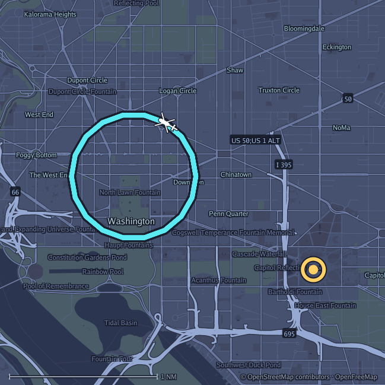
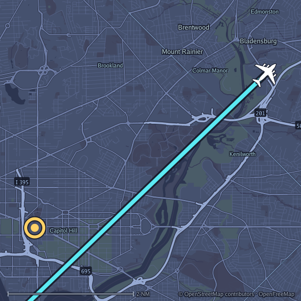
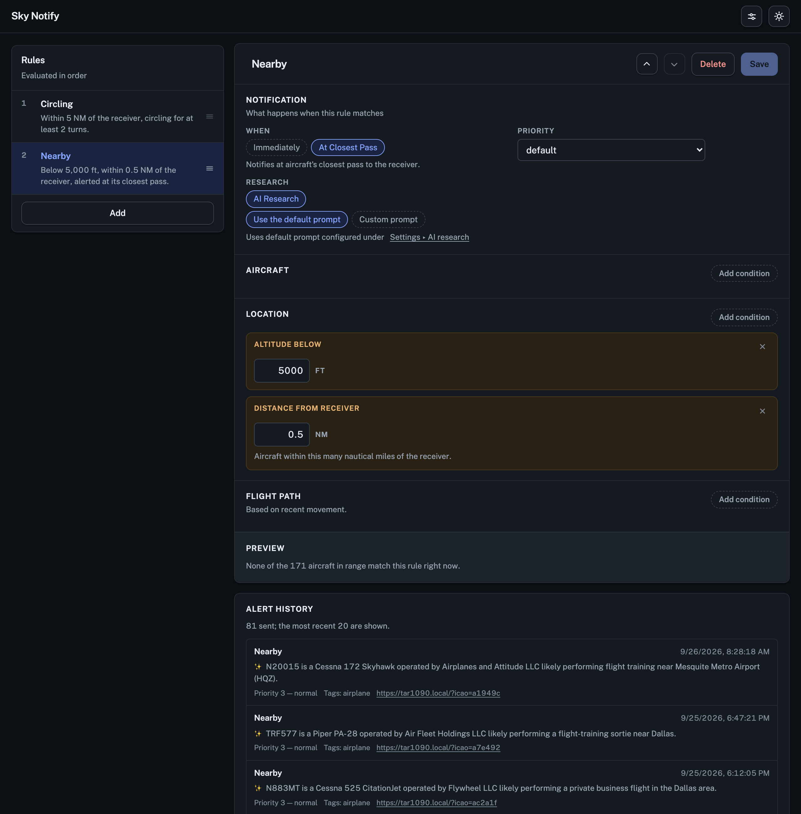
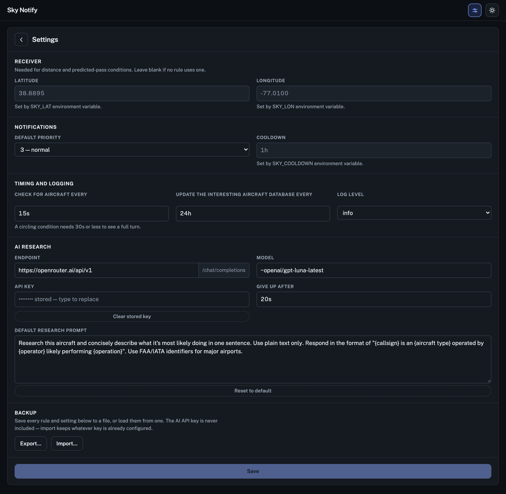

# sky-notify

Get a push notification on your phone when something interesting flies over your house.

sky-notify runs next to your ADS-B receiver ([ultrafeeder](https://github.com/sdr-enthusiasts/docker-adsb-ultrafeeder) / readsb / tar1090),
watches the aircraft it picks up, and sends an [ntfy](https://ntfy.sh) notification when one
matches your rules. It might be a military transport, a police helicopter circling the
neighborhood, or just anything flying low over you. Each alert comes with a map of where the
aircraft is and, if you want it, a one-line AI summary of who it is and what it's probably doing.

<p align="center">
  
  
</p>

## Features

- **Rules you build in a web UI.** Match on operator, aircraft type, category, tags,
  registration, callsign, squawk, altitude, or distance from your receiver. The UI shows
  a live preview of which aircraft each rule would match right now.
- **Flight path detection.** Alert when an aircraft is **circling** (news and police
  helicopters, for example) or is **about to pass over you** within the next few minutes.
- **Alert at the closest pass.** Get the notification once the aircraft has actually gone
  over, with the closest distance it reached, instead of the moment it first shows up.
- **A map in every notification.** Each alert includes a map with your receiver, the
  aircraft drawn as its real silhouette, and its recent track. The map is rendered locally
  with no browser needed.
- **AI research (optional).** Point it at any OpenAI-compatible provider (OpenRouter,
  Ollama, OpenAI, and others) and each alert starts with a short summary like *"N661HD is
  an EC135 operated by the Garland PD air unit, likely performing a patrol orbit."*
- **Built on [plane-alert-db](https://github.com/sdr-enthusiasts/plane-alert-db).** A
  community-curated list of thousands of notable aircraft (military, government, police,
  historic, celebrity jets, and more), kept up to date automatically.
- **Alert history.** See every notification a rule has sent.
- **Cooldowns, priorities, and emergency squawks.** Get one alert per aircraft rather than
  repeats, and set ntfy priority per rule.
- **Password-protected web UI.** Set `SKY_UI_PASSWORD` and the UI asks you to sign in.
- **Backup and restore.** Export all your rules and settings to a file and import them later.
- **Lightweight.** A single small Go binary in one container, for amd64 and arm64.

## Screenshots

**Rule editor** with live preview and alert history:



**Settings**:



## Quick start

Add this to your `docker-compose.yml`:

```yaml
services:
  sky-notify:
    image: ghcr.io/grahamwetzler/sky-notify:latest
    restart: unless-stopped
    ports:
      - "8080:8080"
    environment:
      SKY_SOURCE_URL: http://ultrafeeder/data/aircraft.json
      SKY_NTFY_URL: https://ntfy.sh
      SKY_NTFY_TOPIC: your-secret-topic-name
      SKY_DB_BASE_URL: https://raw.githubusercontent.com/sdr-enthusiasts/plane-alert-db/main
      SKY_DB_FILES: plane-alert-db.csv
      SKY_CACHE_DIR: /data
      SKY_LAT: "38.8895"     # your receiver's location
      SKY_LON: "-77.0100"
      SKY_UI_PASSWORD: ${SKY_UI_PASSWORD:?set a password for the web UI in .env}
    volumes:
      - sky-notify-data:/data
      - sky-notify-config:/config

volumes:
  sky-notify-data:
  sky-notify-config:
```

Then:

1. Choose a password for the web UI and put it in a `.env` file next to the compose file:
   `SKY_UI_PASSWORD=<your own password>`. Docker Compose won't start sky-notify without it.
2. Run `docker compose up -d`.
3. Subscribe to your topic in the [ntfy app](https://ntfy.sh). On public ntfy.sh anyone who
   knows the topic name can read it, so pick something hard to guess.
4. Open `http://<your-server>:8080`, sign in with your password, and add some
   rules. **Nothing alerts until a rule matches.** Try "In the interesting aircraft
   database" to start.

See [`docker-compose.yml`](docker-compose.yml) for a fuller example and
[`config.example.json`](config.example.json) for a starter set of rules.

## Configuration

Most settings live in the web UI. These environment variables cover the rest:

| Variable | Default | |
|---|---|---|
| `SKY_SOURCE_URL` | required | URL or file path of your feeder's `aircraft.json` |
| `SKY_NTFY_URL` | required | `https://ntfy.sh` or your own ntfy server |
| `SKY_NTFY_TOPIC` | required | the topic to publish to |
| `SKY_DB_BASE_URL` | required | where to download plane-alert-db from |
| `SKY_DB_FILES` | required | which database files to use, comma-separated |
| `SKY_CACHE_DIR` | required | where to keep the cached database and alert history |
| `SKY_UI_PASSWORD` | | password for the web UI; without it the UI is open to anyone who can reach it |
| `SKY_LAT` / `SKY_LON` | | your receiver's location, needed for distance and flyover rules |
| `SKY_NTFY_TOKEN` | | ntfy access token (or `SKY_NTFY_USER` + `SKY_NTFY_PASSWORD`) |
| `SKY_TAR1090_URL` | | makes notifications link to the aircraft on your tar1090 map |
| `SKY_COOLDOWN` | `24h` | how long to wait before alerting on the same aircraft again |
| `SKY_MAP_ENABLED` | `true` | attach a map to each notification |
| `SKY_AI_URL` / `SKY_AI_MODEL` / `SKY_AI_KEY` | | AI research provider (can also be set in the UI) |
| `SKY_LISTEN` | `:8080` | address for the web UI and `/healthz` |

A setting made through an environment variable is locked in the web UI.

sky-notify serves plain HTTP, so the password is sent unencrypted. That's fine on a home
network you trust; anywhere else, put it behind a reverse proxy that serves HTTPS (Caddy,
Traefik, nginx) and don't expose port 8080 directly.

## Development

```sh
go test -race ./...
go vet ./...
docker build -t sky-notify .
```

Pushes to `main` publish a multi-arch image to
[`ghcr.io/grahamwetzler/sky-notify`](https://github.com/grahamwetzler/sky-notify/pkgs/container/sky-notify).

## Credits & license

sky-notify is MIT licensed. See [`LICENSE`](LICENSE).

- The aircraft list is [plane-alert-db](https://github.com/sdr-enthusiasts/plane-alert-db)
  by the SDR Enthusiasts, used under ODbL 1.0 / DbCL 1.0.
- Aircraft data comes from [readsb](https://github.com/wiedehopf/readsb) via
  [ultrafeeder](https://github.com/sdr-enthusiasts/docker-adsb-ultrafeeder).
- Map tiles are from [OpenFreeMap](https://openfreemap.org) and © OpenStreetMap contributors.
- The aircraft silhouettes in [`icons.json`](internal/app/icons.json) come from
  [tar1090](https://github.com/wiedehopf/tar1090) and are licensed GPL-2.0-or-later.
  That file and [`icons.go`](internal/app/icons.go) carry tar1090's license.
